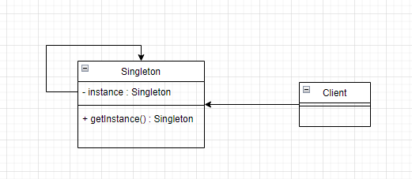

# 单例模式

## 1. 类图



## 2. 代码实现
```java
// 懒汉式单例
public class Singleton1 {  
    private static final Singleton1 instance = new Singleton1();  
  
    private Singleton1() {  
    }  
  
    public static Singleton1 getInstance() {  
        return instance;  
    }  
}
```

```java
// 懒汉式单例
public class Singleton2 {  
    private static Singleton2 instance;  
    private Singleton2() {  
    }  
  
    public static Singleton2 getInstance() {  
        if (Objects.isNull(instance)) {  
            instance = new Singleton2();  
        }  
        return instance;  
    }  
}
```

```java
// 懒汉式双重锁检测单例
public class Singleton3 {  
    private static Singleton3 instance;  
  
    private Singleton3() {  
    }  
  
    public static Singleton3 getInstance() {  
        if (Objects.isNull(instance)) {  
            synchronized (Singleton3.class) {  
                if (Objects.isNull(instance)) {  
                    instance = new Singleton3();  
                }  
            }  
        }  
        return instance;  
    }  
}
```

```java
// 静态内部类实现单例
public class Singleton4 {  
    private Singleton4() {  
    }  
  
    static class Holder {  
        private static final Singleton4 instance = new Singleton4();  
    }  
  
    public static Singleton4 getInstance() {  
        return Holder.instance;  
    }  
}
```

```java
// 枚举实现单例
public enum Singleton5 {  
    instance;  
  
    public static Singleton5 getInstance() {  
        return instance;  
    }  
}
```


完整代码：
[design-pattern/design-pattern-java/src/main/java/pri/hongweihao/singleton at main · hongweihao/design-pattern (github.com)](https://github.com/hongweihao/design-pattern/tree/main/design-pattern-java/src/main/java/pri/hongweihao/singleton)

# 参考
[设计模式之美 (geekbang.org)](https://time.geekbang.org/column/intro/100039001?tab=catalog)


