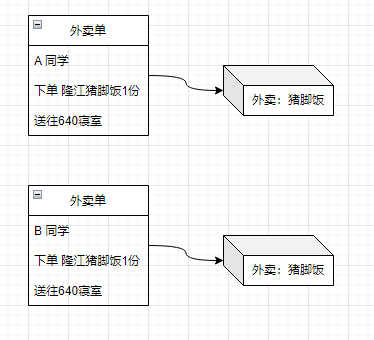
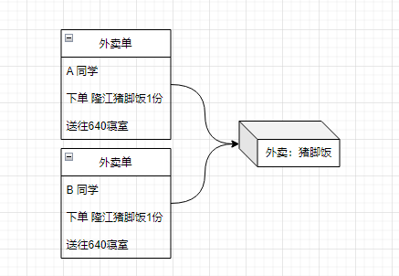

# 原型模式

## 1. 类图


原型模式没什么好说的，需要理解的是重用、深拷贝和浅拷贝。

重用是原型模式的精髓，如果2个对象之间有比较多的共同属性，且这些属性的创建成本比较高，那么就复制过来。例如说抄作业，A 同学花了1个小时做了5道题，B同学花了2分钟把A同学的答案抄过来了。B同学不用操心这5道题怎么做他只需要知道老师检查作业的时候他可以把作业拿出来。

深拷贝和浅拷贝是对象复制的 2 种方式。举个栗子，你和室友一起叫外卖，你们都喜欢吃隆江猪脚饭，就都叫了隆江猪脚饭。

半个小时后，外卖小哥送来了 2 份外卖，外卖上分别贴了 1 张外卖单，你们各自吃着自己的外卖非常和谐。这种是深拷贝，你们都有各自的饭吃。

如果半小时后，外卖小哥送来的是 1 份 外卖，外卖上贴了 2 张外卖单，你先把猪脚给吃了，你室友肯定会和你急。这种是浅拷贝，你吃了猪脚你室友就只能吃白米饭了。

深拷贝：




浅拷贝：



## 2. 代码实现

```java
// 原型类
public class Prototype implements Cloneable {  
    public String key;  
    public Inner inner;  
  
    public Prototype() {  
    }  
  
    @Override  
    public Prototype clone() throws CloneNotSupportedException {  
        return (Prototype) super.clone();  
    }  
  
    public void print() {  
        System.out.println("key: " + this.key);  
        System.out.println("inner: " + inner.name);  
    }  
  
    public static class Inner {  
        public String name;  
  
        public Inner(String name) {  
            this.name = name;  
        }  
    }  
}
```

```java
// 测试类
public class PrototypeTest {  
    @Test  
    public void test() throws CloneNotSupportedException {  
        Prototype prototype = new Prototype();  
        prototype.key = "111";  
        prototype.inner = new Prototype.Inner("aaa");  
        System.out.println("打印prototype对象：");  
        prototype.print();  
  
        Prototype clone = prototype.clone();  
        // clone 对象改了 key 为什么 prototype 对象的 key 没有变化？因为String被定义成不可变的  
        clone.key ="222";  
        // clone 对象改了 inner.name，prototype 对象的 inner.name 也发生了变更  
        clone.inner.name = "bbb";  
  
        System.out.println("-----clone对象修改了key 和 inner.name-------");  
  
  
        System.out.println("再打印prototype对象：");  
        prototype.print();  
    }  
}


打印prototype对象：
key: 111
inner: aaa
-----clone对象修改了key 和 inner.name-------
再打印prototype对象：
key: 111
inner: bbb
```


完整代码：
[design-pattern/design-pattern-java/src/main/java/pri/hongweihao/prototype at main · hongweihao/design-pattern (github.com)](https://github.com/hongweihao/design-pattern/tree/main/design-pattern-java/src/main/java/pri/hongweihao/prototype)

# 参考
[趣学设计模式 - 前京东资深系统架构师 - 拉勾教育 (lagou.com)](https://kaiwu.lagou.com/course/courseInfo.htm?courseId=710#/detail/pc?id=6884)

[设计模式之美 (geekbang.org)](https://time.geekbang.org/column/intro/100039001?tab=catalog)

[重学Java设计模式-付政委-微信读书 (qq.com)](https://weread.qq.com/web/reader/bcf32900724708cbbcf08c1k98f3284021498f137082c2e)

[大话设计模式-程杰-微信读书 (qq.com)](https://weread.qq.com/web/reader/5d932bf0727da1885d91283)