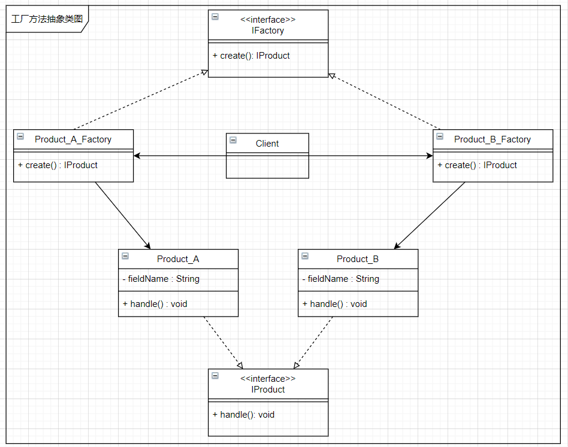
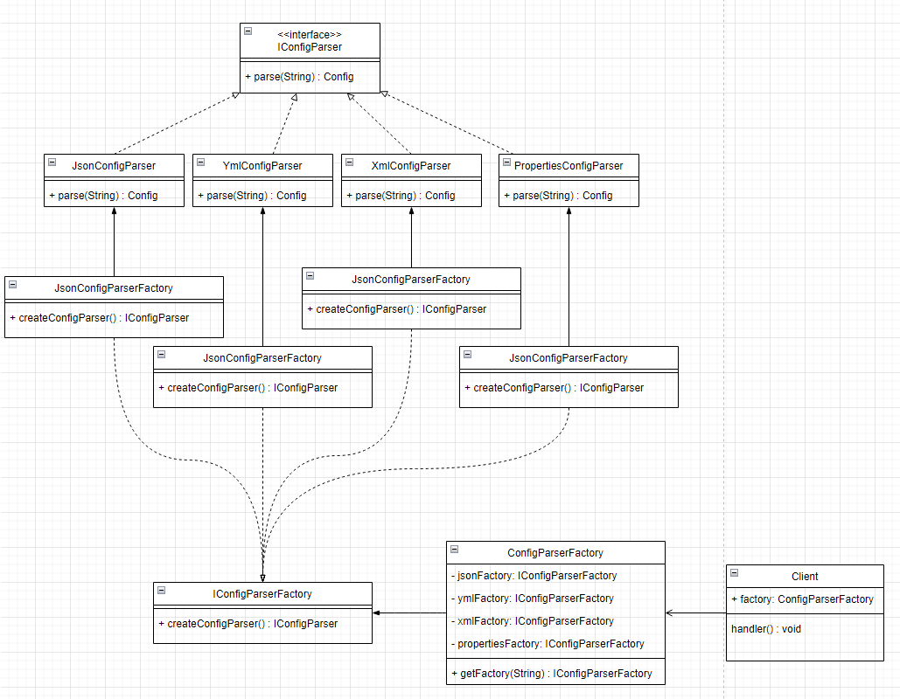

# 工厂方法

## 1. 类图



工厂方法模式和简单工厂差不多，实际在工厂模式的分类上，简单工厂被看作了工厂方法的一种特殊情况。相对于简单工厂，工厂方法为每个产品的具体实现提供了工厂类。在上面的类图中可以看到，`Product_A` 对应了 `Product_A_Factory`，`Product_A` 对应了 `Product_B_Factory`

## 2. 举个栗子

在一个系统中，解析配置文件有多种方式：json、yml、xml和properties等。现在需要封装实现这个模块，要求使用方能方便的使用此模块。

### 2.1 首先理个思路，画个类图：



### 2.2 代码实现

```java
// 产品接口
public interface IConfigParser {
    Config parse(String content);
}
```

```java
// 具体的产品，json 格式的配置文件解析器
public class JsonConfigParser implements IConfigParser {
    @Override
    public Config parse(String content) {
        System.out.println("解析 Json 格式的内容");
        return null;
    }
}
```

```java
// 产品工厂接口
public interface IConfigParserFactory {
    IConfigParser createParser();
}
```

```java
// 产品工厂
public class JsonConfigParserFactory implements IConfigParserFactory {
    @Override
    public IConfigParser createParser() {
        return new JsonConfigParser();
    }
}
```

```java
// 产品工厂的工厂
public class ConfigParserFactory {
    private final IConfigParserFactory jsonConfigParserFactory;
    private final IConfigParserFactory ymlConfigParserFactory;
    private final IConfigParserFactory xmlConfigParserFactory;
    private final IConfigParserFactory propertiesConfigParserFactory;

    public ConfigParserFactory() {
        this.jsonConfigParserFactory = new JsonConfigParserFactory();
        this.ymlConfigParserFactory = new YmlConfigParserFactory();
        this.xmlConfigParserFactory = new XmlConfigParserFactory();
        this.propertiesConfigParserFactory = new PropertiesConfigParserFactory();
    }

    public IConfigParserFactory getFactory(String type) {
        if (type.equals("json")) return this.jsonConfigParserFactory;
        if (type.equals("yml")) return this.ymlConfigParserFactory;
        if (type.equals("xml")) return this.xmlConfigParserFactory;
        if (type.equals("properties")) return this.propertiesConfigParserFactory;
        return null;
    }
}
```

```java
// 测试类
public class FactoryMethodTest {
    @Test
    public void test() {
        IConfigParserFactory parserFactory;
        parserFactory = new JsonConfigParserFactory();
        parserFactory.createParser().parse("");

        parserFactory = new YmlConfigParserFactory();
        parserFactory.createParser().parse("");

        parserFactory = new XmlConfigParserFactory();
        parserFactory.createParser().parse("");

        parserFactory = new PropertiesConfigParserFactory();
        parserFactory.createParser().parse("");
    }

    @Test
    public void getFactory(){
        ConfigParserFactory configParserFactory = new ConfigParserFactory();
        configParserFactory.getFactory("json").createParser().parse("");
        configParserFactory.getFactory("yml").createParser().parse("");
        configParserFactory.getFactory("xml").createParser().parse("");
        configParserFactory.getFactory("properties").createParser().parse("");
    }
}

---------------------------
运行结果
---------------------------
解析 Json 格式的内容
解析 yml 格式的内容
解析 XMl 格式的内容
解析 Properties 格式的内容
---------------------------
```

完整代码：[design-pattern/design-pattern-java/src/main/java/pri/hongweihao/factory/factory_method at main · hongweihao/design-pattern (github.com)](https://github.com/hongweihao/design-pattern/tree/main/design-pattern-java/src/main/java/pri/hongweihao/factory/factory_method)

# 参考
[工厂模式 | 菜鸟教程 (runoob.com)](https://www.runoob.com/design-pattern/factory-pattern.html)

[设计模式篇——工厂模式详解 - 知乎 (zhihu.com)](https://zhuanlan.zhihu.com/p/110419316)

[工厂模式——这一篇真够了_Java_大头星_InfoQ写作社区](https://xie.infoq.cn/article/88c926822394aa1c80847dd2a)

[趣学设计模式 - 前京东资深系统架构师 - 拉勾教育 (lagou.com)](https://kaiwu.lagou.com/course/courseInfo.htm?courseId=710#/detail/pc?id=6884)

[44 | 工厂模式（上）：我为什么说没事不要随便用工厂模式创建对象？ (geekbang.org)](https://time.geekbang.org/column/article/197254)

[重学Java设计模式-付政委-微信读书 (qq.com)](https://weread.qq.com/web/reader/bcf32900724708cbbcf08c1k98f3284021498f137082c2e)