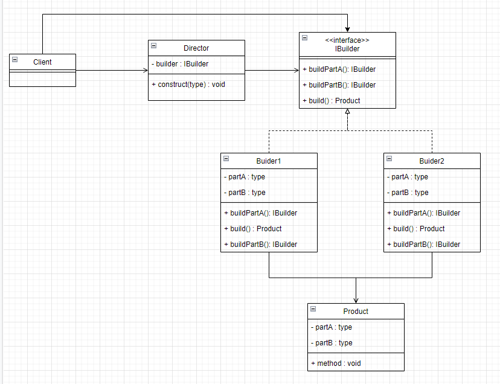
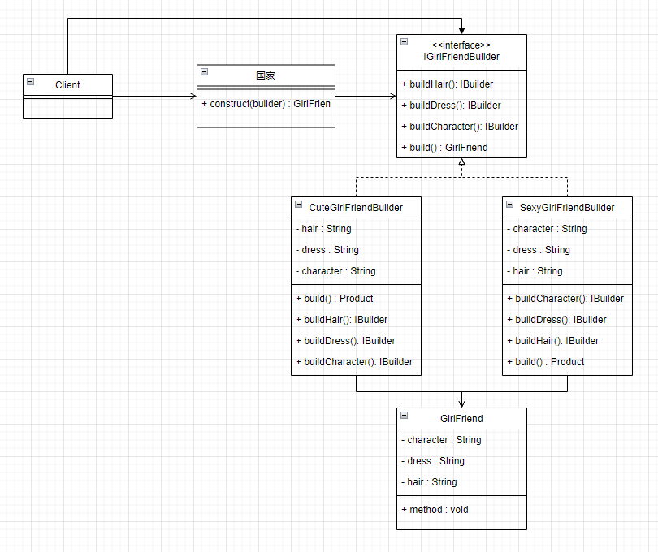

# 建造者模式


## 1. 类图


IBuilder：建造器接口定义建造一个产品所需要的步骤

Builder1：具体的建造者

Product：建造者最终想建造出来的产品

Director：建造器指挥者，用于将建造过程封装起来。举个栗子：你去吃黯然销魂面，你不需要知道做面的人怎么使用黯然销魂掌锤面，再下面。你只需要和他说你要黯然销魂面，然后吃就完了。Director就是把做面的过程封装起来了。


## 2. 举个栗子
> 静态内部类的方式太简单了，就

为了缓解社会结婚率底下，国家允许给大龄青年分配对象了。刚开始你喜欢可爱型的，后面你觉得可爱在性感面前一文不值，最后你觉得都不是你的类型所以决定出柜。

#### 2.1 画个类图，理下思路




#### 2.2 代码实现

```java
// 建造器的目标对象
public class GirlFriend {  
    // 发型  
    private final String hair;  
    // 穿着  
    private final String dress;  
    // 性格  
    private final String character;  
    // ......  
  
    public GirlFriend(String hair, String dress, String character) {  
        this.hair = hair;  
        this.dress = dress;  
        this.character = character;  
    }  
  
    public void print() {  
        System.out.println("国家分配了一个女朋友");  
        System.out.println("她留着" + this.hair);  
        System.out.println("她穿着" + this.dress);  
        System.out.println("她的性格" + this.character);  
        System.out.println("哇，我好幸福！");  
    }  
}
```

```java
// 建造者接口
public interface IGirlFriendBuilder {  
    IGirlFriendBuilder buildHair();  
    IGirlFriendBuilder buildDress();  
    IGirlFriendBuilder buildCharacter();  
    GirlFriend getResult();  
}
```

```java
// 具体建造者：可爱的对象建造者
public class CuteGirlFriendBuilder implements IGirlFriendBuilder {  
    // 发型  
    private String hair;  
    // 穿着  
    private String dress;  
    // 性格  
    private String character;  
  
    @Override  
    public IGirlFriendBuilder buildHair() {  
        this.hair = "乌黑靓丽的长发";  
        return this;    }  
  
    @Override  
    public IGirlFriendBuilder buildDress() {  
        this.dress = "广袖流仙裙";  
        return this;    }  
  
    @Override  
    public IGirlFriendBuilder buildCharacter() {  
        this.character = "开朗活泼";  
        return this;    }  
  
    @Override  
    public GirlFriend getResult() {  
        return new GirlFriend(this.hair, this.dress, this.character);  
    }  
}
```


```java
// 指挥者对象
public class Country {  
    public void construct(IGirlFriendBuilder builder) {  
        builder.buildHair()  
                .buildDress()  
                .buildCharacter();  
    }  
}
```


```java
// 测试类
public class CountryGrantTest {  
    @Test  
    public void test() {  
        Country country = new Country();  
  
        // 刚开始你喜欢可爱性的  
        CuteGirlFriendBuilder cuteGirlFriendBuilder = new CuteGirlFriendBuilder();  
        country.construct(cuteGirlFriendBuilder);  
        cuteGirlFriendBuilder.getResult().print();  
  
        System.out.println("-----------------");  
  
  
        // 后来你觉得可爱在性感面前一文不值  
        SexyGirlFriendBuilder sexyGirlFriendBuilder = new SexyGirlFriendBuilder();  
        country.construct(sexyGirlFriendBuilder);  
        sexyGirlFriendBuilder.getResult().print();  
    }  
}

---------------------------
运行结果
---------------------------
国家分配了一个女朋友
她留着乌黑靓丽的长发
她穿着广袖流仙裙
她的性格开朗活泼
哇，我好幸福！
-----------------
国家分配了一个女朋友
她留着金色的长发
她穿着性感睡衣
她的性格有点腹黑
哇，我好幸福！
---------------------------
```


完整代码：[design-pattern/design-pattern-java/src/main/java/pri/hongweihao/builder at main · hongweihao/design-pattern (github.com)](https://github.com/hongweihao/design-pattern/tree/main/design-pattern-java/src/main/java/pri/hongweihao/builder)


# 参考
[趣学设计模式 - 前京东资深系统架构师 - 拉勾教育 (lagou.com)](https://kaiwu.lagou.com/course/courseInfo.htm?courseId=710#/detail/pc?id=6884)

[设计模式之美 (geekbang.org)](https://time.geekbang.org/column/intro/100039001?tab=catalog)

[重学Java设计模式-付政委-微信读书 (qq.com)](https://weread.qq.com/web/reader/bcf32900724708cbbcf08c1k98f3284021498f137082c2e)

[大话设计模式-程杰-微信读书 (qq.com)](https://weread.qq.com/web/reader/5d932bf0727da1885d91283)

