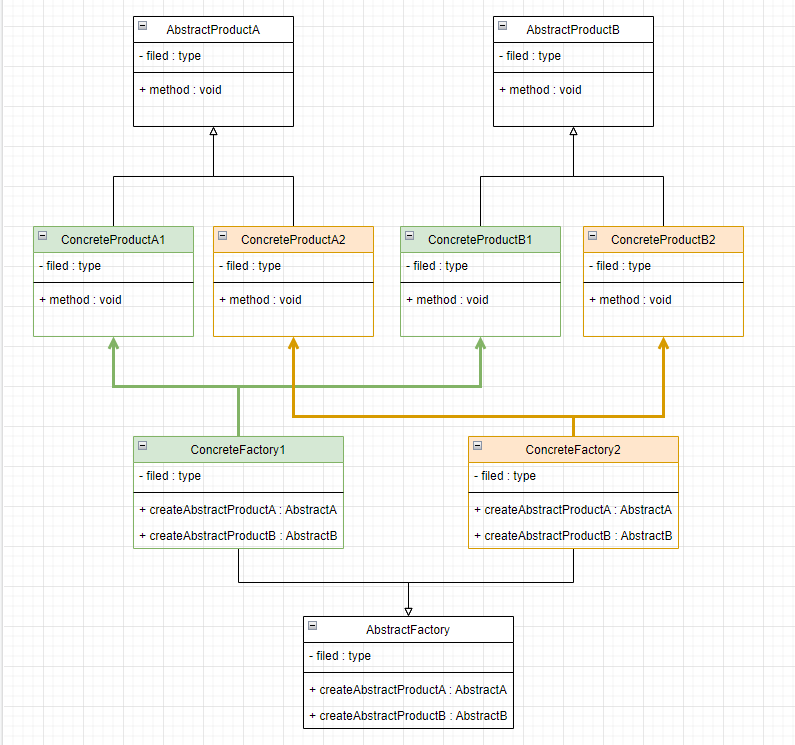
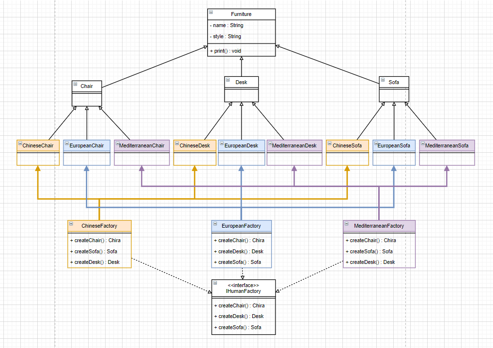

# 抽象工厂

## 1. 类图



抽象工厂模式是工厂方法的升级版。对于抽象工厂方法来说，一个工厂可以生产一个产品族；而对于工厂方法，一个工厂只能生成一个产品，实在是太浪费了。举个栗子，工厂方法相当一个椅子工厂，只能生产椅子；抽象工厂相当于一个家具厂，不仅能生产椅子还能生产桌子和沙发等家具。这个家具厂能生产的产品就称为产品族。

学习抽象工厂需要理解 2 个概念：抽象工厂和抽象产品。上图中，`AbstractFactory` 就是一个创建产品族的抽象工厂，`AbstractProductA` 和 `AbstractProductB` 就是抽象产品。其中抽象产品的确定主导了整个设计。

## 2. 举个栗子

一个抽象工厂能生产桌子，椅子和沙发。同时这 3 类产品有不同的风格，中国风，欧美风和地中海风。

### 2.1 首先理个思路，画个类图



这里有个技巧，将产品看成是 2 维的，然后选择 1 个维度中的概念作为抽象产品。例如，这里的家具从 2 个维度理解：

- 用途：椅子，桌子，沙发
- 风格：中国风，欧美风，地中海风

我们选择用途的维度作为抽象产品，那就可以得出 3 种抽象产品：椅子，桌子和沙发。

再选择另一个维度作为抽象工厂实现，那就可以得出 3 种抽象工厂：中国风工厂，欧美风工厂和地中海风工厂。

### 2.2 代码实现

```java
// 抽象产品父类
public abstract class Furniture {
    // 家具名称，用途
    protected String name;
    // 风格
    protected String style;

    public void print(){
        System.out.println(style + " style " + name);
    }
}
```

```java
// 抽象产品
public class Chair extends Furniture {
    public Chair() {
        super();
        this.name = "chair";
    }
}
```

```java
// 具体产品
public class ChineseChair extends Chair {
    public ChineseChair(){
        super();
        this.name = "chair";
        this.style = "Chinese";
    }
} 
```

```java
// 抽象工厂
public interface IFurnitureFactory {
    Chair createChair();
    Desk createDesk();
    Sofa createSofa();
}
```

```java
// 抽象工厂实现
public class ChineseFurnitureFactory implements IFurnitureFactory {
    @Override
    public Chair createChair() {
        return new ChineseChair();
    }

    @Override
    public Desk createDesk() {
        return new ChineseDesk();
    }

    @Override
    public Sofa createSofa() {
        return new ChineseSofa();
    }
}
```

```java
// 测试类
public class AbstractFactoryFurnitureExampleTest {
    @Test
    public void test() {
        IFurnitureFactory factory;

        // 中国风的家具
        factory = new ChineseFurnitureFactory();
        factory.createChair().print();
        factory.createDesk().print();
        factory.createSofa().print();

        // 欧美风的家具
        factory = new EuropeanFurnitureFactory();
        factory.createChair().print();
        factory.createDesk().print();
        factory.createSofa().print();

        // 地中海风的家具
        factory = new MediterraneanFurnitureFactory();
        factory.createChair().print();
        factory.createDesk().print();
        factory.createSofa().print();
    }
}

---------------------------
运行结果
---------------------------
Chinese style chair
Chinese style desk
Chinese style sofa
European style chair
European style desk
European style sofa
Mediterranean style chair
Mediterranean style desk
Mediterranean style sofa
---------------------------
```

完整代码：[design-pattern/design-pattern-java/src/main/java/pri/hongweihao/factory/abstract_factory/furniture at main · hongweihao/design-pattern (github.com)](https://github.com/hongweihao/design-pattern/tree/main/design-pattern-java/src/main/java/pri/hongweihao/factory/abstract_factory/furniture)

另一个实例：[design-pattern/design-pattern-java/src/main/java/pri/hongweihao/factory/abstract_factory/create_human_by_nvwa at main · hongweihao/design-pattern (github.com)](https://github.com/hongweihao/design-pattern/tree/main/design-pattern-java/src/main/java/pri/hongweihao/factory/abstract_factory/create_human_by_nvwa)

# 参考

[工厂模式 | 菜鸟教程 (runoob.com)](https://www.runoob.com/design-pattern/factory-pattern.html)

[设计模式篇——工厂模式详解 - 知乎 (zhihu.com)](https://zhuanlan.zhihu.com/p/110419316)

[工厂模式——这一篇真够了_Java_大头星_InfoQ写作社区](https://xie.infoq.cn/article/88c926822394aa1c80847dd2a)

[趣学设计模式 - 前京东资深系统架构师 - 拉勾教育 (lagou.com)](https://kaiwu.lagou.com/course/courseInfo.htm?courseId=710#/detail/pc?id=6884)

[44 | 工厂模式（上）：我为什么说没事不要随便用工厂模式创建对象？ (geekbang.org)](https://time.geekbang.org/column/article/197254)

[重学Java设计模式-付政委-微信读书 (qq.com)](https://weread.qq.com/web/reader/bcf32900724708cbbcf08c1k98f3284021498f137082c2e)