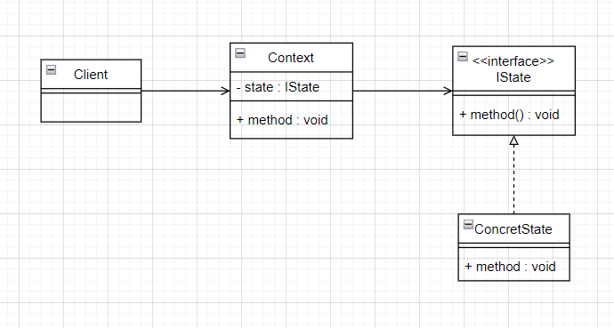
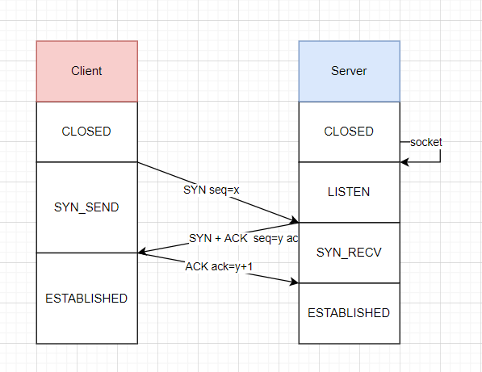
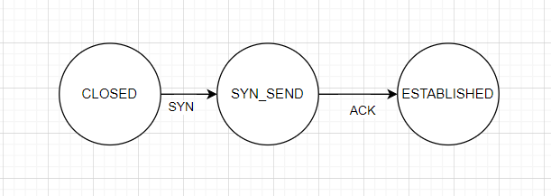
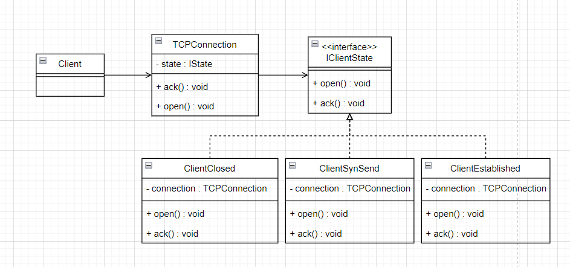

# 状态模式
## 1. 类图




## 2. 举个栗子
TCP 建立连接的过程中需要经历“三次握手”：


1. 初始状态为 `CLOSED` 的客户端，发送 SYN 标志的数据包给服务端请求建立连接，变更自身状态为 `SYN_SEND`
2. 服务端接收到来自客户端 的 SYN 标志数据包，发送 ACK+SYN 标志数据包回客户端，变更自身状态为 `SYN_RECV`
3. 客户端接收到来自服务端的数据包，表示服务端确认了客户端的连接请求并请求和客户端建立链接。再针对来自服务端的 SYN 标志数据包回应一个 ACK标志数据包。发送后变更自身状态为 `ESTABLISHED`
4. 服务端接收到来自客户端的 ACK 标志数据包，变更自身状态为 `ESTABLISHED`


梳理客户端状态变化：



### 2.1 画个类图，理清思路




### 2.2 代码实现
```java
public interface IClientState {  
    void open();  
  
    void ack();  
}
```


```java
public class ClientClosed implements IClientState {  
    private final TCPConnection tcpConnection;  
  
    public ClientClosed(TCPConnection tcpConnection) {  
        this.tcpConnection = tcpConnection;  
    }  
  
    @Override  
    public void open() {  
        System.out.println("向服务器端发送 SYN 数据包");  
        tcpConnection.setState(new ClientSynSend(tcpConnection));  
    }  
  
    @Override  
    public void ack() {  
        throw new UnsupportedOperationException();  
    }  
}
```

```java
public class ClientSynSend implements IClientState {  
    private final TCPConnection tcpConnection;  
  
    public ClientSynSend(TCPConnection tcpConnection) {  
        this.tcpConnection = tcpConnection;  
    }  
  
    @Override  
    public void open() {  
        System.out.println("已经发起了连接请求，无需继续建立连接。");  
    }  
  
    @Override  
    public void ack() {  
        System.out.println("接收到来自服务器端的 ACK 确认包和 SYN 数据包");  
        System.out.println("向服务器端发送来自服务器的SYN 数据的 ACK 确认包");  
        tcpConnection.setState(new ClientEstablished());  
    }  
}
```

```java
public class ClientEstablished implements IClientState {  
    @Override  
    public void open() {  
        System.out.println("连接已建立，无需继续建立连接");  
    }  
  
    @Override  
    public void ack() {  
        System.out.println("连接已建立，丢弃确认包");  
    }  
}
```


```java
public class TCPConnection {  
    private IClientState state;  
  
    public TCPConnection() {  
        this.state = new ClientClosed(this);  
    }  
  
    public TCPConnection(IClientState state) {  
        this.state = state;  
    }  
  
    public void open() {  
        state.open();  
    }  
  
    public void ack() {  
        state.ack();  
        state = new ClientEstablished();  
    }  
  
    public void setState(IClientState state) {  
        this.state = state;  
    }  
  
    public void showState() {  
        System.out.println(this.state);  
    }  
}
```

```java
public class TCPConnectionTest {  
    @Test  
    public void test() {  
        TCPConnection tcpConnection = new TCPConnection();  
  
        tcpConnection.open();  
        tcpConnection.showState();  
  
        tcpConnection.ack();  
        tcpConnection.showState();  
  
        tcpConnection.open();  
        tcpConnection.ack();  
    }  
}

-------------------------------------------------
向服务器端发送 SYN 数据包
pri.hongweihao.state.tcp.ClientSynSend@6e8dacdf
接收到来自服务器端的 ACK 确认包和 SYN 数据包
向服务器端发送来自服务器的SYN 数据的 ACK 确认包
pri.hongweihao.state.tcp.ClientEstablished@34ce8af7
连接已建立，无需继续建立连接
连接已建立，丢弃确认包
```

完整代码：[design-pattern/design-pattern-java/src/main/java/pri/hongweihao/state at main · hongweihao/design-pattern (github.com)](https://github.com/hongweihao/design-pattern/tree/main/design-pattern-java/src/main/java/pri/hongweihao/state)

# 参考
《设计模式：可复用面向对象软件的基础》
[设计模式之美 (geekbang.org)](https://time.geekbang.org/column/intro/100039001?tab=catalog)

