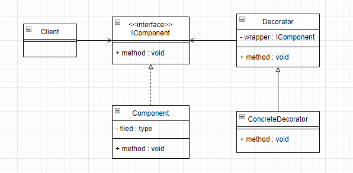
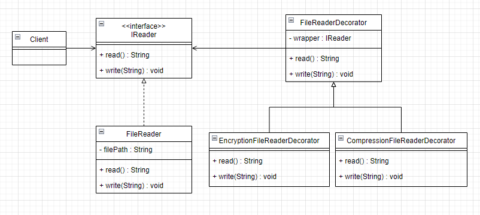

# 装饰模式
## 1. 类图



## 2. 举个栗子
写入和读取文件内容时，要求先压缩、加密后再写入文件，同时读取文件内容时，应该先解密再解压缩才能返回正确的内容。


### 2.1 画个类图，理清思路



### 2.2 代码实现
```java
public interface IReader {  
    String read();  
  
    void write(String content);  
}
```

```java
public class FileReader implements IReader {  
    private final String filepath;  
  
    public FileReader(String filepath) {  
        this.filepath = filepath;  
    }  
  
    @Override  
    public String read() {  
        String content = "file content";  
        System.out.println("从" + filepath + "中读出内容: " + content);  
        return content;  
    }  
  
    @Override  
    public void write(String content) {  
        System.out.println("写入到" + filepath + ": " + content);  
    }  
}
```

```java
public class FileReaderDecorator implements IReader {  
    private final IReader fileReader;  
  
    public FileReaderDecorator(IReader fileReader) {  
        this.fileReader = fileReader;  
    }  
  
    @Override  
    public String read() {  
        return fileReader.read();  
    }  
  
    @Override  
    public void write(String content) {  
        fileReader.write(content);  
    }  
}
```

```java
public class CompressionFileReaderDecorator extends FileReaderDecorator {  
    public CompressionFileReaderDecorator(IReader fileReader) {  
        super(fileReader);  
    }  
  
    @Override  
    public String read() {  
        String read = super.read();  
        String decompress = "decompress:" + read;  
        System.out.println("把读出来的文件内容解压缩：" + decompress);  
        return decompress;  
    }  
  
    @Override  
    public void write(String content) {  
        String compress = "compress:" + content;  
        System.out.println("把写入内容压缩:" + compress);  
        super.write(compress);  
    }  
}
```


```java
public class EncryptionFileReaderDecorator extends FileReaderDecorator {  
    public EncryptionFileReaderDecorator(IReader fileReader) {  
        super(fileReader);  
    }  
  
    @Override  
    public String read() {  
        String read = super.read();  
        String decode = "decode:" + read;  
        System.out.println("把读出来的文件内容解密：" + decode);  
        return decode;  
    }  
  
    @Override  
    public void write(String content) {  
        String compress = "encode:" + content;  
        System.out.println("把写入内容加密: " + compress);  
        super.write(compress);  
    }  
}
```

```java
public class DecoratorTest {  
    @Test  
    public void test() {  
        IReader fileReader = new FileReader("/root/test.txt");  
        IReader encryptionFileReader = new EncryptionFileReaderDecorator(fileReader);  
        IReader compressionFileReader = new CompressionFileReaderDecorator(encryptionFileReader);  
  
        compressionFileReader.write("file content");  
        System.out.println("--------------------------");  
        compressionFileReader.read();  
  
    }  
}

-------------------------------------------------
把写入内容压缩:compress:file content
把写入内容加密: encode:compress:file content
写入到/root/test.txt: encode:compress:file content
--------------------------
从/root/test.txt中读出内容: file content
把读出来的文件内容解密：decode:file content
把读出来的文件内容解压缩：decompress:decode:file content
```

完整代码：[design-pattern/design-pattern-java/src/main/java/pri/hongweihao/decorator at main · hongweihao/design-pattern (github.com)](https://github.com/hongweihao/design-pattern/tree/main/design-pattern-java/src/main/java/pri/hongweihao/decorator)

# 参考
[设计模式之美 (geekbang.org)](https://time.geekbang.org/column/intro/100039001?tab=catalog)

[趣学设计模式 - 前京东资深系统架构师 - 拉勾教育 (lagou.com)](https://kaiwu.lagou.com/course/courseInfo.htm?courseId=710#/detail/pc?id=6890)