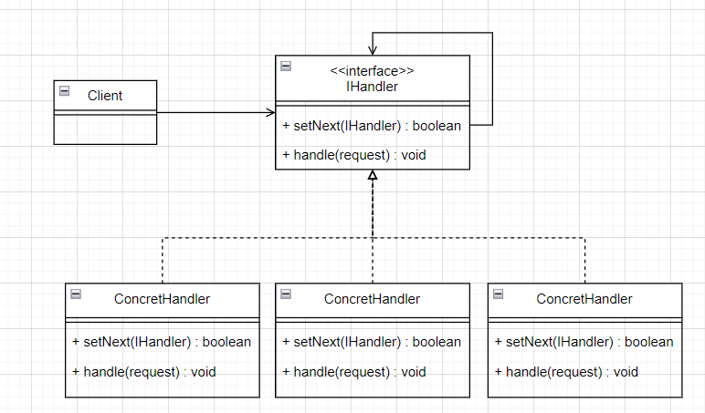
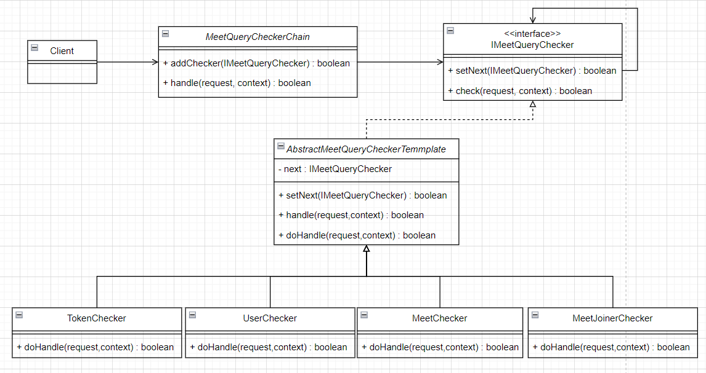

# 责任链模式
## 1. 类图




## 2. 举个栗子
查询在线会议信息接口，要求：
- token有效
- 用户ID有效
- 会议ID有效
- 邀请成员列表包含当前用户ID


### 2.1 画个类图，理清思路




IMeetQueryChecker：一系列检查器的接口，对应原始类图中的 `IHandler` 接口

AbstractMeetQueryCheckerTemmplate：抽象模板类。在每个 `Checker` 实现中，都存在设置 next 和checker 成功之后调用下一个 checker。抽象模板类把这部分重复的代码统一起来，并提供一个抽象方法给 checker 去实现，checker 仅需要关注检验的行为。

TokenChecker：token 检验器

MeetQueryCheckerChain：链对象。封装添加 checker 和执行 checker 的行为。链对象有 2 种封装方式：
- 顺序表：chain 对象中维护一个列表，执行链条时循环执行
- 链表：chain 对象中维护一个链表的 head 以及 tail 指针，执行时仅需要执行 head 的 check方法，由当前 checker 负责下一个 checker 的调用。


### 2.2 代码实现
```java
// 检查器接口
public interface IMeetQueryChecker {  
    boolean setNext(IMeetQueryChecker checker);  
  
    boolean check(Map<String, String> request, Map<String, Object> context);  
}
```


```java
// 实现检查器接口的抽象模板类
public abstract class AbstractMeetQueryCheckerTemplate implements IMeetQueryChecker {  
    protected IMeetQueryChecker next;  
  
    @Override  
    public boolean setNext(IMeetQueryChecker checker) {  
        this.next = checker;  
        return true;    }  
  
    @Override  
    public boolean check(Map<String, String> request, Map<String, Object> context) {  
        if (doCheck(request, context) && !Objects.isNull(this.next)) {  
            return this.next.check(request, context);  
        }  
        return false;  
    }  
  
    public abstract boolean doCheck(Map<String, String> request, Map<String, Object> context);  
}
```

```java
// 具体的检查器实现类
public class MeetChecker extends AbstractMeetQueryCheckerTemplate {  
    @Override  
    public boolean doCheck(Map<String, String> request, Map<String, Object> context) {  
        System.out.println("查询会议是否存在...");  
        context.put("meet", "MEET_INFO");  
        return true;    }  
}
```

```java
// 检查器链，封装添加检查器和调用检查器的行为
public class NodeMeetQueryCheckerChain {  
    private IMeetQueryChecker head;  
    private IMeetQueryChecker tail;  
  
    public boolean addChecker(IMeetQueryChecker checker) {  
        if (Objects.isNull(tail)) {  
            head = checker;  
        } else {  
            tail.setNext(checker);  
        }  
        tail = checker;  
        return true;    }  
  
    public boolean check(Map<String, String> request, Map<String, Object> context) {  
        return head.check(request, context);  
    }  
}
```


```java
public class NodeMeetQueryCheckerChainTest {  
    @Test  
    public void test() {  
        IMeetQueryChecker tokenChecker = new TokenChecker();  
        IMeetQueryChecker userChecker = new UserChecker();  
        IMeetQueryChecker meetChecker = new MeetChecker();  
        IMeetQueryChecker meetJoinerChecker = new MeetJoinerChecker();  
  
        NodeMeetQueryCheckerChain chain = new NodeMeetQueryCheckerChain();  
        chain.addChecker(tokenChecker);  
        chain.addChecker(userChecker);  
        chain.addChecker(meetChecker);  
        chain.addChecker(meetJoinerChecker);  
  
        chain.check(null, new HashMap<>());  
    }  
}

---------------------
校验 token...
查询用户是否存在...
查询会议是否存在...
查询用户是否会议参会人...
```


完整代码：[design-pattern/design-pattern-java/src/main/java/pri/hongweihao/chain_of_responsibility at main · hongweihao/design-pattern (github.com)](https://github.com/hongweihao/design-pattern/tree/main/design-pattern-java/src/main/java/pri/hongweihao/chain_of_responsibility)


# 参考
[62 | 职责链模式（上）：如何实现可灵活扩展算法的敏感信息过滤框架？-极客时间 (geekbang.org)](https://time.geekbang.org/column/article/216278)


