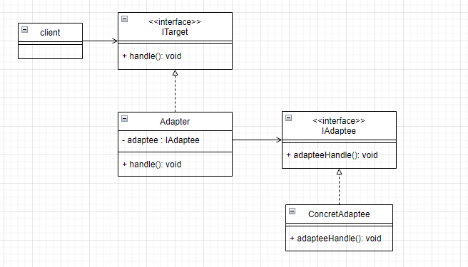
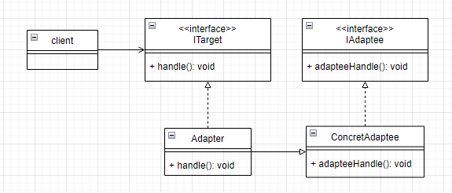
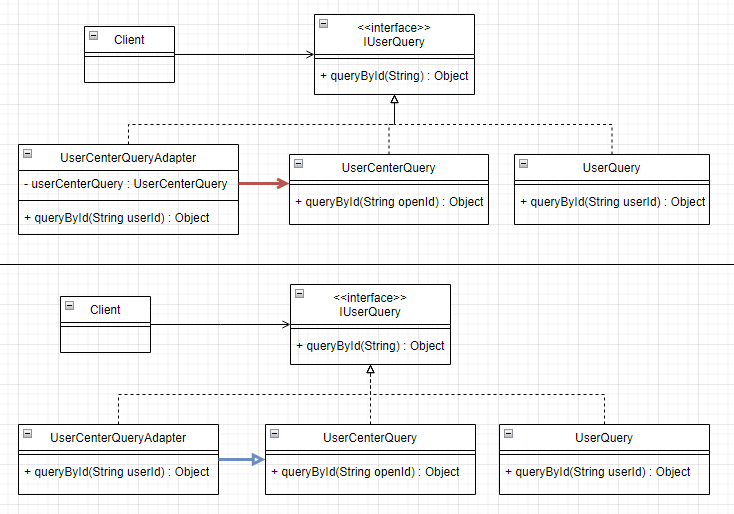

# 适配器模式
## 1. 类图

### 1.1 对象适配器方式
> 通过组合



### 1.2 类适配器方式
> 通过继承



## 2. 举个栗子
我们正在开发一个微信小程序，后来微信觉得我们开发的小程序不错，于是就把我们的小程序收购了
打算整合进微信的环境中。

原来我们的小程序拉微信用户信息的时候是通过单点登录的方式来拉取的，存在小程序的服务端user表里。表结构类似为：user : (id, user_name, open_id, third_user_info)

整合进微信环境中时，要求使用统一的用户中心来拉取用户信息，不再通过小程序的 user 表查询。
于是，小程序中旧的拉取用户信息接口需要切换成从用户中心拉取用户信息。

### 2.1 画个类图，理清思路



### 2.2 代码实现
```java
public interface IUserQuery {  
    Object queryById(String id);  
}
```


```java
public class UserQuery implements IUserQuery {  
    @Override  
    public Object queryById(String userId) {  
        System.out.println("使用userId查询用户表中的用户信息: " + userId);  
        return new Object();  
    }  
}
```

```java
public class UserCenterQuery implements IUserQuery {  
    @Override  
    public Object queryById(String openId) {  
        System.out.println("使用openId通过用户中心查询用户信息: " + openId);  
        return new Object();  
    }  
}
```

```java
// 对象适配器，通过组合的方式
public class UserCenterQueryAdapter implements IUserQuery {  
    private final UserCenterQuery userCenterQuery;  
  
    public UserCenterQueryAdapter(UserCenterQuery userCenterQuery) {  
        this.userCenterQuery = userCenterQuery;  
    }  
  
    @Override  
    public Object queryById(String userId) {  
        // 把旧的userId转换成用户中心的openId  
        String openId = selectOpenIdByUserId(userId);  
        return userCenterQuery.queryById(openId);  
    }  
  
    private String selectOpenIdByUserId(String userId) {  
        return "openId";  
    }  
}
```


```java
// 类适配器，通过继承的方式
public class ExtUserQueryAdapter extends UserCenterQuery implements IUserQuery {  
    @Override  
    public Object queryById(String userId) {  
        String id = selectOpenIdByUserId(userId);  
        return super.queryById(id);  
    }  
  
    private String selectOpenIdByUserId(String userId) {  
        return "openId";  
    }  
}
```

```java

public class AdapterTest {  
    @Test  
    public void test() {  
        // 旧的方式，使用userId直接查询用户表的信息  
        UserQuery userQuery = new UserQuery();  
        userQuery.queryById("userId");  
  
        // 适配：通过用户中心查询用户信息  
        UserCenterQuery userCenterQuery = new UserCenterQuery();  
  
        // 对象适配器，组合  
        IUserQuery userQueryAdapter = new UserCenterQueryAdapter(userCenterQuery);  
        userQueryAdapter.queryById("userId");  
  
        // 类适配器，继承  
        IUserQuery extUserQueryAdapter = new ExtUserQueryAdapter();  
        extUserQueryAdapter.queryById("userId");  
    }  
}


-------------------------------------------------
使用userId查询用户表中的用户信息: userId
使用openId通过用户中心查询用户信息: openId
使用openId通过用户中心查询用户信息: openId
```

完整代码：[design-pattern/design-pattern-java/src/main/java/pri/hongweihao/adapter at main · hongweihao/design-pattern (github.com)](https://github.com/hongweihao/design-pattern/tree/main/design-pattern-java/src/main/java/pri/hongweihao/adapter)

# 参考
[设计模式之美 (geekbang.org)](https://time.geekbang.org/column/intro/100039001?tab=catalog)
